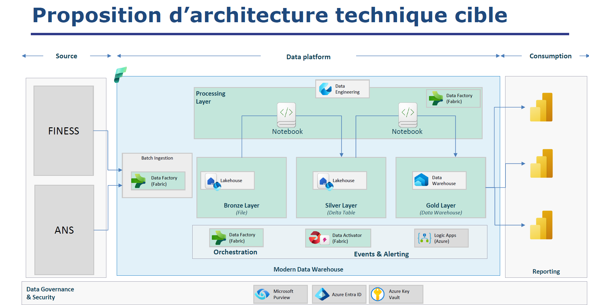

# FirstFabricProject
Analyse des Données des Établissements de Santé de France

# MICROSOFT FABRIC : DEVELOPPEMENT D'UN PIPELINE DATA : Data Factory, Lakehouse, Data Warehouse, Notebook
Ce projet permet de maîtriser un pipeline ETL/ELT moderne et d'analyser les données provenant de différentes sources.

## Approche
Collecter, nettoyer, normaliser et modéliser les données.

Mettre en place un modèle décisionnel (modèle en étoile).

Créer des tableaux de bord interactifs pour la visualisation des indicateurs clés (KPI).

Orchestrer l’ingestion des données de manière quotidienne.

Archiver l’historique des données collectées.

## Technologies utilisées
Microsoft Fabric (Data Factory, Lakehouse, Data Warehouse, Notebook)

Azure Logic Apps (Orchestration)

Microsoft Purview (Gouvernance et sécurité)

Azure Entra ID et Key Vault (Sécurité)

## Dataset 
FINESS Site : data.gouv.fr
Format : CSV
Documentation : Documentation FINESS

ANS Site : annuaire.sante.fr
Format : ZIP (contenant des fichiers CSV)
Fichier principal : PS_LibreAcces_Personne_activite_*

Relations entre les jeux de données Clés communes : numéro FINESS, nom d’établissement

## Architecture technique Modèle en médaillon : 
BRONZE : Données brutes dans un Lakehouse (stockées par source).
SILVER : Données nettoyées et normalisées dans des tables Delta (Lakehouse)
GOLD : Données enrichies prêtes à l’analyse dans un entrepôt de données (Data Warehouse, modèle étoile).

## Indicateurs Clés (KPI) 
Nombre d’établissements par localité (commune)
Nombre d’établissements par profession
Nombre d’établissements par profession
Autres métriques personnalisées

## Fréquence et orchestration Collecte quotidienne automatisée via Microsoft Fabric (Data Factory)

Archivage journalier des données collectées

Gestion des événements et alertes avec Data Activator ou Logic Apps

